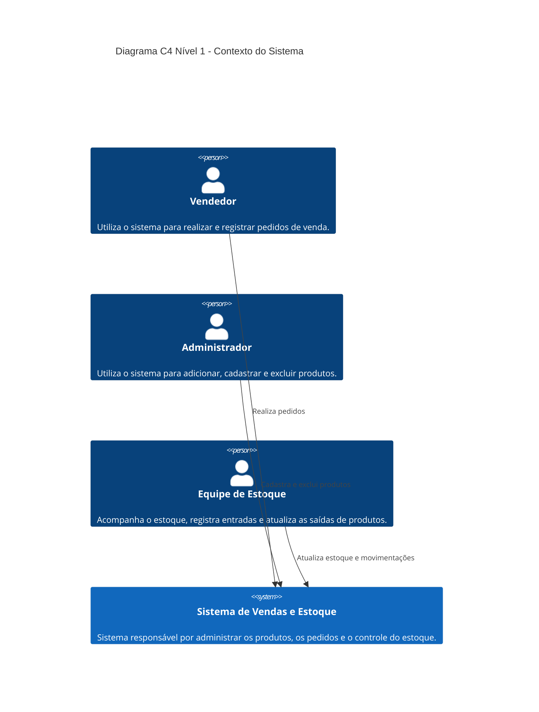

# Diagrama C4 Nível 1 (Contexto)

Representação geral do Sistema de Vendas e Estoque, mostrando os principais usuários e a forma como cada um utiliza a plataforma.

```mermaid
C4Context

title Diagrama C4 Nível 1 - Contexto do Sistema

Person(vendedor, "Vendedor", "Utiliza o sistema para realizar e registrar pedidos de venda.")

Person(admin, "Administrador", "Utiliza o sistema para adicionar, cadastrar e excluir produtos.")

Person(estoque, "Equipe de Estoque", "Acompanha o estoque, registra entradas e atualiza as saídas de produtos.")

System(sistema_vendas, "Sistema de Vendas e Estoque", "Sistema responsável por administrar os produtos, os pedidos e o controle do estoque.")

Rel(vendedor, sistema_vendas, "Realiza pedidos")

Rel(admin, sistema_vendas, "Cadastra e exclui produtos")

Rel(estoque, sistema_vendas, "Atualiza estoque e movimentações")
```
