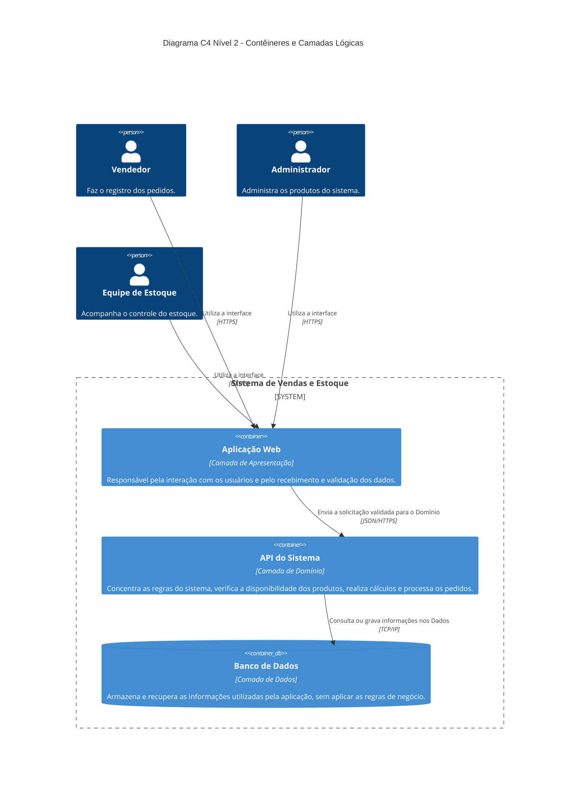

# Diagrama C4 Nível 2 (Organizado por Camadas Lógicas)

Detalhamento dos contêineres do sistema, mostrando a separação das responsabilidades entre as camadas de Apresentação, Domínio e Dados.

```mermaid
C4Container

title Diagrama C4 Nível 2 - Contêineres e Camadas Lógicas

Person(vendedor, "Vendedor", "Faz o registro dos pedidos.")

Person(admin, "Administrador", "Administra os produtos do sistema.")

Person(estoque, "Equipe de Estoque", "Acompanha o controle do estoque.")

System_Boundary(sistema_vendas_boundary, "Sistema de Vendas e Estoque") {

    Container(frontend, "Aplicação Web", "Camada de Apresentação", "Responsável pela interação com os usuários e pelo recebimento e validação dos dados.")

    Container(api, "API do Sistema", "Camada de Domínio", "Concentra as regras do sistema, verifica a disponibilidade dos produtos, realiza cálculos e processa os pedidos.")

    ContainerDb(database, "Banco de Dados", "Camada de Dados", "Armazena e recupera as informações utilizadas pela aplicação, sem aplicar as regras de negócio.")

}

Rel(vendedor, frontend, "Utiliza a interface", "HTTPS")

Rel(admin, frontend, "Utiliza a interface", "HTTPS")

Rel(estoque, frontend, "Utiliza a interface", "HTTPS")

Rel(frontend, api, "Envia a solicitação validada para o Domínio", "JSON/HTTPS")

Rel(api, database, "Consulta ou grava informações nos Dados", "TCP/IP")
```
